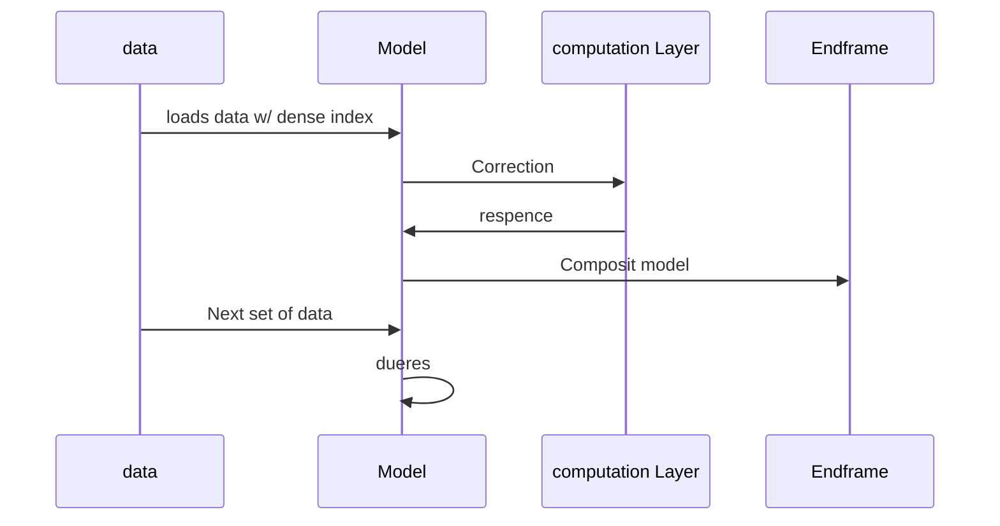

#  [Dense Pose Using Wifi signals: (But deep down a batman radar)](https://arxiv.org/pdf/2301.00250.pdf)
>  #**Table Of Content**
>
>> #### [what is human pose estimation](#what-is-human-pose-estimation)
>> - Bottom-up vs. Top-down methods
>> - Types of Pose Estimation
>> - Main Challenges of Pose Detection
>
>> ### [Dense Pose Detection Using Wifi](#dense-pose-detection-using-wifi)
>


# What is Human Pose Estimation
Human pose estimation and tracking is a computer vision task that includes detecting, associating, and tracking semantic key points. Examples of semantic keypoints are “right shoulders,” “left knees,” or the “left brake lights of vehicles.” 

### Bottom-up vs. Top-down methods 
All approaches for pose estimation can be grouped into bottom-up and top-down methods. 
- **Bottom-up:** methods estimate each body joint first and then group them to form a unique pose. Bottom-up methods were pioneered with DeepCut (a method we will cover later in more detail).
- **Top-down:** methods run a person detector first and estimate body joints within the detected bounding boxes.  
Read more at: [https://viso.ai/deep-learning/pose-estimation-ultimate-overview/](https://viso.ai/deep-learning/pose-estimation-ultimate-overview/)

### Types of Pose Estimation
-  2D Pose estimation
		this estimation techniqe provides a rather stickman like configuration where a persons body joints are a pivit point and constructs a 2d imaginory prototype of a man's posture
- 3D Pose Estimation
		3d Pose estimation provides an overall cover over of signals over the surface of an object kind of 3d object detectiion where subjects mass plays the part

### Main Challenges of Pose Detection  
while there are many challanges to estimate the posture of a person we have more then one techniqes to get the data most of which represent the data signal with a view based response that meeanse there can be many point and situations which can led to a false or unable read
- ***LIDAR Sensor***
- ***Camara***
- ~~Motion Sensor~~
- ***Radar***
- **wifi Signal**


> ---
> while there are many pose detection method the DensePose provides the most provident results
>
>---


## Dense Pose Detection Using Wifi

DensePose: This is a pose estimation technique that aims at mapping all human pixels of an RGB image to the 3D surface of the human body. DensePose can also be used for single and multiple pose estimation problems.  

![[Screenshot from 2023-02-03 14-45-06.png]]

In raw CSI samples (5 consecutive samples visualized in Figure), the amplitude (𝐴) and phase $(Φ)$ of each complex element $𝑧 = 𝑎 +𝑏𝑖$ are computed using the formulation 𝐴 = √︁ (𝑎 2 + 𝑏 2 ) and Φ = 𝑎𝑟𝑐𝑡𝑎𝑛(𝑏/𝑎). Note that the range of the arctan function is from $-\pi$ to $\pi$  and the phase values outside this range get wrapped, leading to a discontinuity in phase values. Our first sanitization step is to unwrap the phase following

> $$
\Delta \Phi 𝑖 , 𝑗 = \Phi𝑖,𝑗+1 − \Phi𝑖,𝑗 $$ 
> $$ \textrm{if} \quad \Delta \phi𝑖,𝑗 > \pi, \Phi 𝑖,𝑗 + 1 = \Phi 𝑖,𝑗 + \Delta \Phi𝑖,𝑗 − 2\pi $$
> $$ \textrm{if} \quad \Delta\Phi𝑖,𝑗 < −\pi, \Phi𝑖,𝑗+1 = \Phi𝑖,𝑗 + \delta \phi𝑖,𝑗 + 2,$$


osses The total loss of our approach is computed as: 

>$$𝐿 = 𝐿𝑐𝑙𝑠 + 𝐿𝑏𝑜𝑥 + \Lambda𝑑𝑝𝐿𝑑𝑝 + \Lambda𝑘𝑝𝐿𝑘𝑝 + \Lambda𝑡𝑟 𝐿𝑡𝑟, $$
>$$\textrm{Where} \quad 𝐿𝑐𝑙𝑠 , 𝐿𝑏𝑜𝑥, 𝐿𝑑𝑝, 𝐿𝑘𝑝, 𝐿𝑡𝑟$$

are losses for the person classification, bounding box regression, DensePose, keypoints, and transfer learning respectively. The classification loss 𝐿𝑐𝑙𝑠 and the box regression loss 𝐿𝑏𝑜𝑥 are standard RCNN losses [9, 21].

![[Screenshot from 2023-02-03 15-09-13.png]]


To measure the performance of DensePose detection, we follow the original DensePose paper [8]. We first compute Geodesic Point Similarity (GPS) as a matching score for dense correspondences:

>$$
GPS_j= \frac{1}{| P_j |} \displaystyle \sum_{p\in P_j} \textrm{exp}(\frac{-g(i_p,\hat{i}_p)^{2}}{2k^{2}}),$$


#### WiFi-based DensePose under Same Layout


Method | AP | AP@50 | AP@75 | AP-m | AP-l
--|--|--|--|--|--|
WiFi | 43.5 | 87.2 | 44.6 | 38.1 | 46.4


#### Comparison with Image-based DensePose
Method | AP | AP@50 | AP@75 | AP-m | AP-l |
--|--|--|--|--|--|
WiFi | 43.5 | 87.2 | 44.6 | 38.1 |46.4 |
Image| 84.7| 94.4| 77.1 | 70.3 | 83.8|

---

### Here is an example of tensorflow DensePose detection

```shell
pip install -q opencv-python
```

```python
import csv
import cv2
import itertools
import numpy as np
import pandas as pd
import os
import sys
import tempfile
import tqdm

from matplotlib import pyplot as plt
from matplotlib.collections import LineCollection

import tensorflow as tf
import tensorflow_hub as hub
from tensorflow import keras

from sklearn.model_selection import train_test_split
from sklearn.metrics import accuracy_score, classification_report, confusion_matrix

```

```python
if use_custom_dataset:
  # ATTENTION:
  # You must edit these two lines to match your archive and images folder name:
  # !tar -xf YOUR_DATASET_ARCHIVE_NAME.tar
  !unzip -q YOUR_DATASET_ARCHIVE_NAME.zip
  dataset_in = 'YOUR_DATASET_DIR_NAME'

  # You can leave the rest alone:
  if not os.path.isdir(dataset_in):
    raise Exception("dataset_in is not a valid directory")
  if dataset_is_split:
    IMAGES_ROOT = dataset_in
  else:
    dataset_out = 'split_' + dataset_in
    split_into_train_test(dataset_in, dataset_out, test_split=0.2)
    IMAGES_ROOT = dataset_out
```
```python
if not is_skip_step_1 and not use_custom_dataset:
  !wget -O yoga_poses.zip http://download.tensorflow.org/data/pose_classification/yoga_poses.zip
  !unzip -q yoga_poses.zip -d yoga_cg
  IMAGES_ROOT = "yoga_cg"
```

[rest of the code](https://www.tensorflow.org/lite/tutorials/pose_classification)



### **References:**

- https://arxiv.org/pdf/2301.00250.pdf
- https://viso.ai/deep-learning/pose-estimation-ultimate-overview/


	
	

